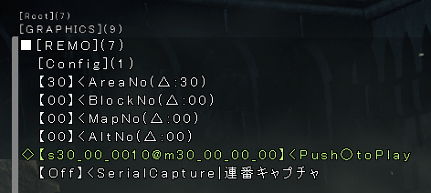

# Cutscenes

Cutscenes are internally called "Remo". I don't know what that means.

Cutscenes all have IDs that look like this: `sAA_BB_XXXX`.

- `AA` is the 2-digit map/area code. E.g. 30 is Lothric (Highwall + Castle) and 37 is Irithyll. It's the same number that's used in the map name (e.g. `m30`).
- `BB` is the 2-digit block code. This is `00` for most places, with few exceptions.
- `XXXX` is the 4-digit cutscene number. Cutscenes typically have numbers starting at 0000 and going up. The last digit is usually 0.

E.g. `s30_00_0000` is the cutscene where the player holds up the banner after defeating vordt, and `s30_00_0010` is the Dancer cutscene.

A list of [all cutscene IDs can be found below](#all-cutscenes).

## Playing a cutscene

Open the debug menu and go to _GRAPHICS > REMO_.

_AreaNo_ and _BlockNo_ are the `AA` and `BB` parts of the cutscene ID. _MapNo_ and _AltNo_ are ignored, just leave them as 0. Use the Triangle button to set the area and block numbers to the location you are currently in.

Below those 4 inputs is an input like this: `[s30_00_0000@m30_00_00_00]`. `s30_00_0000` is the cutscene ID. Use Left and Right on the D-Pad to change the last 4 digits of the ID. (Tip: Hold L1 while pressing Left or Right to change the digits in increments of 10.) Use this to enter the cutscene ID.

After entering the ID, press the Circle button to play the cutscene.

**WARNING:** Playing multiple cutsenes will cause them to queue up. This feature is extremely buggy. It can lead from crashes to the game getting stuck. Only play one cutscene at a time.

_Note:_ Playing cutscenes only plays the cutscene. It will not teleport you to the cutscene location, or have any effects on the game state. E.g. playing the Dancer cutscene will not teleport you to the Dancer boss room and start the fight.

_Note:_ You can play any cutscene from anywhere. E.g. you can play the Dancer cutscene in Firelink Shrine. This is pretty useless though, since no assets will be loaded in. This can also cause the game to crash.

## All cutscenes

High Wall of Lothric / The Consumed King's Garden:

- `s30_00_0000`: Player holds up banner after defeating Vordt and is taken to the Undead Settlement
- `s30_00_0010`: Dancer emerges from the darkness
- `s30_00_0020`: Placing the Basin of Vows after defeating the Dancer
- `s30_00_0030`: Vordt appears
- `s30_00_0040`: Ocieros the Consumed King appears
- `s30_00_9000`: Left over cutscene from scrapped bonfire kindling mechanic (takes place in the Darkwraith's dungeon)

Lothric Castle:

- `s30_01_0000`: Dummy
- `s30_01_0010`: Dummy
- `s30_01_0020`: Dummy

Undead Settlement:

- `s31_00_0000`: The player is taken to the Pit of Hollows (Mound-Makers)
- `s31_00_0010`: Player holds up banner after defeating Vordt and is taken to the Undead Settlement (no idea why that is in here twice)

Archdragon Peak:

- `s32_00_0000`: We ring the bell to call the storm
- `s32_00_0010`: Nameless King fight: Transition to phase 2
- `s32_00_0020`: Nameless King fight: The storm retreats; we defeat the Nameless King
- `s32_00_0030`: We get summoned after defeating the Ancient Wyvern

Road of Sacrifices / Farron Keep:

- `s33_00_0000`: Abyss Watchers fight: Transition to phase 2
- `s33_00_0010`: Abyss Watchers fight: Starting cutscene
- `s33_00_0020`: Snuffing out the flames in Farron Keep (long version) (1)
- `s33_00_0021`: Snuffing out the flames in Farron Keep (long version) (2)
- `s33_00_0022`: Snuffing out the flames in Farron Keep (long version) (3)
- `s33_00_0023`: Snuffing out the flames in Farron Keep (long version) (4) (scrapped 4-th flame for Seath)
- `s33_00_0030`: Snuffing out the flames in Farron Keep (short version) (1)
- `s33_00_0031`: Snuffing out the flames in Farron Keep (short version) (2)
- `s33_00_0032`: Snuffing out the flames in Farron Keep (short version) (3)
- `s33_00_0033`: Snuffing out the flames in Farron Keep (short version) (4) (scrapped 4-th flame for Seath)
- `s33_00_0040`: Snuffing out the flames in Farron Keep (short version + door open) (1)
- `s33_00_0041`: Snuffing out the flames in Farron Keep (short version + door open) (2)
- `s33_00_0042`: Snuffing out the flames in Farron Keep (short version + door open) (3)
- `s33_00_0043`: Snuffing out the flames in Farron Keep (short version + door open) (4) (scrapped 4-th flame for Seath)

Grand Archives:

- `s34_00_0000`: Twin Princess fight: Transition to phase 2 (broken version; likely early version)
- `s34_00_0010`: Dummy
- `s34_00_0020`: Dummy
- `s34_01_0000`: Twin Princess fight: Transition to phase 2
- `s34_01_0010`: Twin Princess fight: Starting cutscene
- `s34_01_0020`: Doesn't work

Cathedral of the Deep:

- `s35_00_0000`: Patches tricks us ("Shame on you, you greedy guts!")
- `s35_00_0001`: Patches tricks us ("Shame on you, you rotten nun!")
- `s35_00_0010`: Dummy
- `s35_00_0050`: Ariandel: Gael takes us to Ariandel
- `s35_00_0051`: Ariandel: We touch the painting and are taken to Ariandel

Irithyll of the Boreal Valley:

- `s37_00_0000`: Doesn't work
- `s37_00_0010`: Doesn't work
- `s37_00_0020`: We marry (kill) our partner in the Darkmoon Tomb (M)
- `s37_00_0021`: We marry (kill) our partner in the Darkmoon Tomb (F)
- `s37_00_0030`: We are summoned to Lothric by Emma after defeating Aldrich

Carthus Catacombs / Smouldering Lake:

- `s38_00_0000`: The player touches the spooky cup and is taken to Volnir
- `s38_00_0010`: The player touches the spooky cup and is taken to Volnir (duplicate)
- `s38_00_0020`: We defeated Volnir and darkness returns in the cup
- `s38_00_0030`: Doesn't work

Irithyll Dungeon / The Profaned Capital:

- `s39_00_0010`: Dozing off and being taken to Archdragon Peak
- `s39_00_0020`: Siegward cutscene for Yhorm
- `s39_00_0030`: We are summoned to Lothric by Emma after defeating Yhorm

Cemetery of Ash / Firelink Shrine / Untended Graves:

- `s40_00_0000`: Doesn't work
- `s40_00_0010`: Doesn't work
- `s40_00_0020`: Lords of Cinder are burned and we are taken to the Flameless Shrine
- `s40_00_0021`: Lords of Cinder are burned and we are taken to the Flameless Shrine
- `s40_00_0030`: Doesn't work
- `s40_00_0040`: Opening cutscene; we rise from our coffin (start of the game)
- `s40_00_0050`: Doesn't work
- `s40_00_0060`: Dummy
- `s40_00_9000`: Pilgrim at fire in the broken kiln on which Oswald rests (scrapped cutscene)

Kiln of the First Flame / The Flameless Shrine:

- `s41_00_0000`: We link the fire (Ending 1: To Link The First Flame)
- `s41_00_0010`: Doesn't work
- `s41_00_0030`: Doesn't work
- `s41_00_0050`: We usurp the fire (M) (Ending 4: Usurpation of Fire)
- `s41_00_0051`: We usurp the fire (F) (Ending 4: Usurpation of Fire)
- `s41_00_0060`: We call the Fire Keeper (Ending 2: The End of Fire)
- `s41_00_0070`: We kick down the Fire Keeper (Ending 3: Unkindled Ending)

Painted World of Ariandel:

- `s45_00_0000`: Friede fight: Starting cutscene ("Bring Friede to me, please.")
- `s45_00_0010`: Friede fight: Transition to phase 2
- `s45_00_0030`: Spin the wheel to move the statue and reveal the secret passage to Father Ariandel
- `s45_00_0031`: Alt version of the above without Friede's dialogue (likely unfinished)
- `s45_00_0090`: Doesn't work

The Ringed City:

- `s51_00_0000`: The player holds up the banner and is taken to the Ringed City
- `s51_00_0010`: Patches kicks us down ("Every age it seems is tainted by the greed of men.")
- `s51_01_0000`: We touch the egg and disturb Filianore's slumber
- `s51_01_0005`: Gael fight: Starting cutscene ("What? Still here? Hand it over, that thing, your dark soul.")
- `s51_01_0010`: Gael fight: Transition to phase 2 ("Ahh, is this the blood? The blood of the dark soul?")
