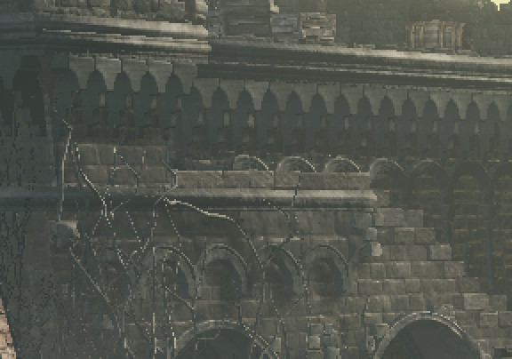

# How to take screenshots

## Positioning the camera

To freely position the camera, press circle + R3 to go into free cam mode. You can then move the camera around with the left stick, go up and down with R2 and L2, and make movement slow and faster with R1 and L1. Pressing Circle + R3 again will exit free cam mode.

During free cam mode, the right stick (which normally moves the camera) does nothing. There is a hacky way to change the angle of the camera however. Press Start to open the quick menu. While the menu is open, left-click with your mouse outside the menu and move the mouse around. This change the camera angle. \
This is hacky, because the camera bugs out if you're not quick enough. You only have around 1 second to adjust the camera's angle. Repeat this until you have the desired angle. Be careful not to go over your 1 second time limit. Once broken, the camera will remain broken until you exit free cam mode.

## Forcing LOD 0

To make sure everything looks their best, we will force LOD 0 in the debug menu.

1. Press Select to open the Debug menu.
2. Go to Graphics > RendMan > Stage Rend > LOD & 描画距離 (LOD & Draw Distance).
3. Select the option `[-1] LODレベルオーバーライド` (LOD level override). It's the third option.
4. Set the value to 0.

This will force the game to always render the highest quality models, regardless of distance.

Next, we will force the game to render the highest quality textures. In the same menu, go down to `[0.00]距離バイアス(m):テクスチャLOD切り替え距離(Lv1<->Lv2)` (Distance bias (m): Texture LOD distance switching (Lv1<->Lv2)). Set the value to around 200. (Hint: Hold L1 while pressing D-pad left or right to change the value faster.)

The game now renders everything with the highest quality models and textures, regardless of distance.

### Increasing draw distances

Next, we will increase the draw distance of objects and enemies, and their shadows.

In the same menu as before, go down to `[0.00]距離バイアス(m):通常距離` (Distance bias (m): Normal distance) and `[0.00]距離バイアス(m):影描画距離` (Distance bias (m): Shadow draw distance) and set both to 200.

That's it.

## Taking the screenshot

1. Press Select to open the Debug menu.
2. Go to Graphics > GFX > \[Screen Capture\]. It's the second last option.

You will be greeted by a lot of Japanese. Here's what it all means:

- `[メニュー]<キャプチャ範囲` - Capture Range. This doesn't seem to do anything, just leave it as メニュー (Menu).
- `[BMP]<フォーマット` - Format. Either BMP, JPG, PNG, DDS, or TIFF.
- `[100[%]]<倍率` - Magnification. This will change the resolution of the screenshot relative to your current game resolution.
- `[128[pix]]<高解像度キャプチャ時のオーバーラップ` - Overlap when capturing high resolution.
- `[on]<高解像度キャプチャ中にタイルに分割` - Split into tiles during high-resolution capture.
- `[off]<Write to capture result` - Write to capture result. This doesn't seem to do anything.
- `キャプチャ(□+◯)<1920x1080.BMP` - Capture. Press Square + Circle to take the screenshot. The displayed resolution here will depend on your current resolution and selected magnification. Same for the format.

As for how capturing works: there are 2 capture modes: tiled mode and non-tiled mode.

- Tiled mode will split your high-res screenshot into tiles that are the size of your current resolution. For example, at 200% magnification, it will split the high-res screenshot into 2x2 tiles. The game will then simply render those tiles and stich them together into one screenshot.

  This method is very fast, because the game only has to move your camera around for each tile. However, it can cause some issues. All screen-space visual effects will be rendered for each tile. This means that if you have a lot of visual effects on screen, they will be rendered multiple times, which can cause some visual issues. This is especially noticeable with the bloom effect since a bright light source (e.g. the sun or moon) causing the bloom may not be visible in all tiles.

  Note: The overlap option was likely supposed to lessen these issues, but it doesn't work. It only stretched the image. Always set overlap to 0px when using tiled mode.

  Example: I dropped my resolution down to 800x450 and took a 300% magnification screenshot. We can see that the moon's bloom is suddenly cut of at tile boundaries.

  

- Non-tiled mode will render the high-res screenshot in one go.

  This method is very resource intensive. The game is essentially running at a much higher resolution for one frame to take the screenshot. Depending on your GPU, this can take a while or may even crash the game if the maginification is too high. However, this method is more accurate.

  Example: Like before, I dropped my resolution down to 800x450 and took a 300% magnification screenshot. I also turned off light shafts here (more on this later).

  

I recommend non-tiled mode. While more resource intensive, it's more accurate.

As for settings:

- Format: PNG. PNG is lossless, so it will look the best.
- Magnification: at least 200%. This will give us 4K and higher. I typically take 8K (or higher) screenshots and then downscale them to 4K to get really good anti-aliasing.
- Split into tiles: off. We want non-tiled mode.

That's it. Go down to `キャプチャ(□+◯)` and press Square + Circle to take the screenshot. Your game will not respond while taking the screenshot. This will take a few seconds (or even a minute).

The screenshot will be saved to `<your steam library>/DARK SOULS III/capture/fdp/screenshot`. To get there, open Steam, right click on Dark Souls III, go to Manage > Browse Local Files.

## Fixing artifacts in non-tiled mode

There are 2 artifacts that can appear in non-tiled mode:

1. Light shafts (e.g. from the sun or moon) may appear way too bright. I don't know why this happens. Light shaft always seem too bright when taking screenshots in non-tiled mode.
2. The bloom effect may be too weak. This is because the bloom effect has a max radius (of sorts) in pixels that doesn't scale with resolution. So the same max pixel radius is use for all resolutions.

### Fixing bloom

1. Press Select to open the Debug menu.
2. Go to Graphics > RendMan > Stage Rend.
3. Select the first option `screenGUIWidget` and press circle to open it.

You will now see a window with a lot of options. These options control pretty much everything about the graphics of the game. There's too much to go into here, so we will focus on your bloom issue.

This window is navigated using your mouse. Scrolling doesn't work, so you have to drag to the scroll bar of the right.

1. Open `PostEffect` (second last).
2. Open `Settings & Info`.
3. Check the `Ignore setup from outside` checkbox. This will allow us to change the bloom settings. Otherwise, they would be readonly. (Tip: if you ever accidentally change a setting you didn't want to change, uncheck the option and everything will be reset to default.)
4. Under `PostEffect`, open `Bloom` and then `Detail Info`.
5. Set `GlareNumLevels` to 16 (max value).

Bloom is now fixed.

### Fixing light shafts

There are 2 ways to fix them:

1. Turning off light shaft.
2. Manually adjusting their strength.

For both, follow the Bloom section above until after you enable `Ignore setup from outside`. Then:

1. Under `PostEffect`, open `Light shafts`.
2. Either
   1. Uncheck `Enable` to turn off light shafts.
   2. Lower the number `ShaftLength` to lower the strength of the light shafts. I typically use 0.2.

Tip: You can still navigate the debug menu while the GUI window is open. This is useful when choosing a value for `ShaftLength`. Just navigate back to Graphics > GFX > \[Screen Capture\] and take screenshots with different values for `ShaftLength` until you find one you like. The GUI window will not appear in the screenshot.

